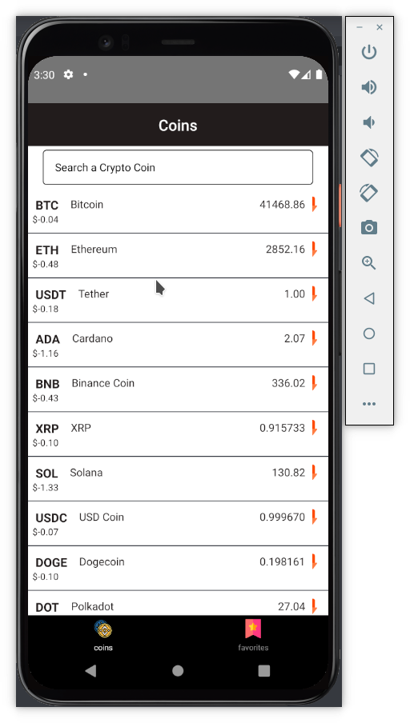
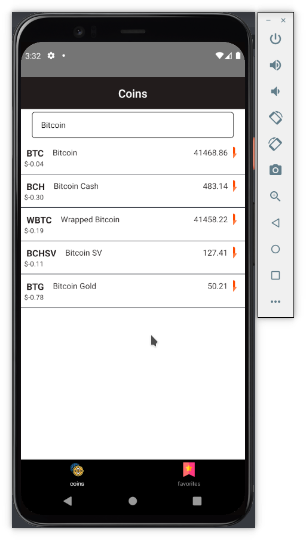

# CryptoCat react-native-crypto-traker-app

Full aplicatioon made whit react native, rigth now it just works in Android i cant compile on ios.

## Functionality

### MENU

You see the full list of the cryptos where you can select one to see it states or search for an specific cryptos.

when you click on the cryptos you can watch the stats for the current crypto that you select.

Here you can add or remove the current cryptos to your favorite page.

## Working on

- Remove the bug of the library local storage where sometimes it doesn't add to favorites the current cryptos
- Splash screen
- empty favorite list styles
- ios app vertion